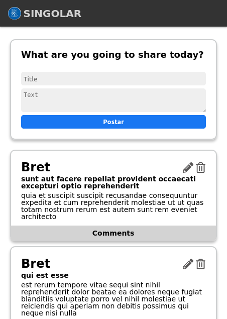
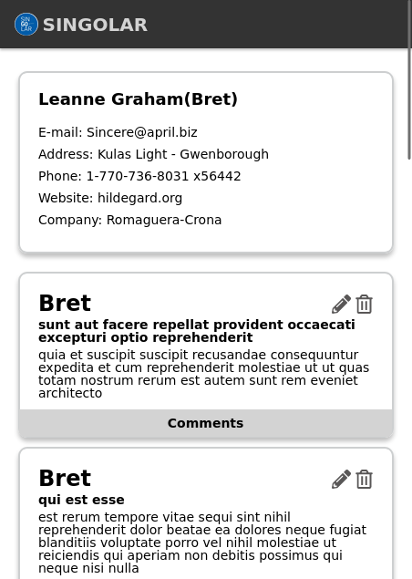
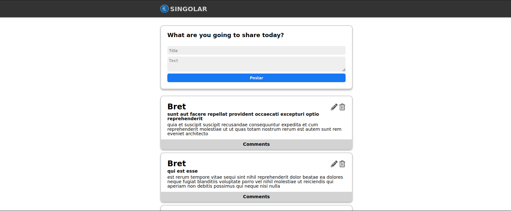
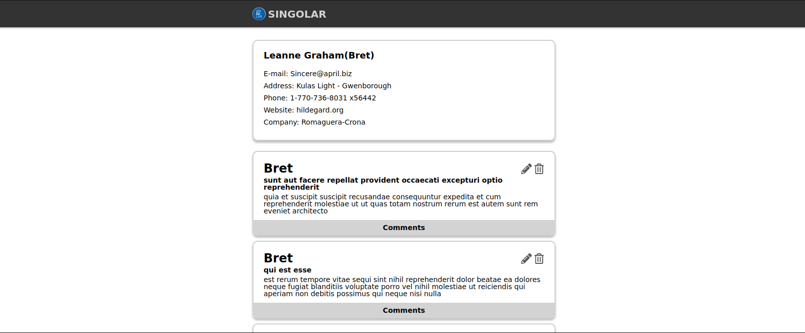

## 💻 Teste Singolar 

---

## ⚙️ Funcionalidades

- [x] Listar posts
  - [x] cada post contém username, title e body
  - [x] ao clicar no username o usuario é redirecionado para pagina do user do post
  - [x] comentarios de cada postagem e opção de deletar e editar postagem
  - [x] ao clicar no username o usuario é redirecionado para pagina do user do post

- [x] Pagina do User:
  - [x] informações do user
  - [x] todos os posts do user

---

## 🎨 Layout

### Mobile

  

  

### Web

  

  

---
